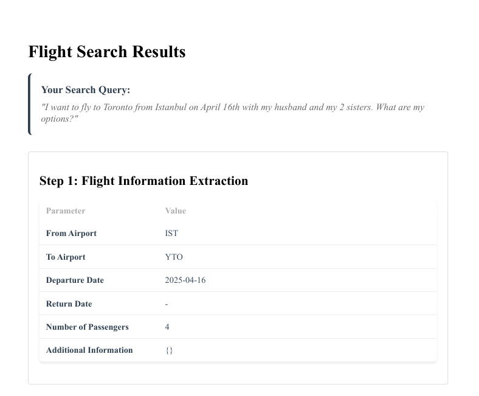
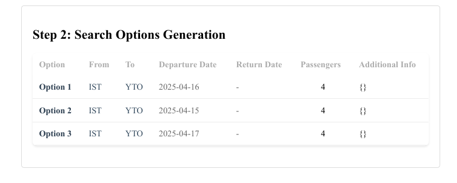
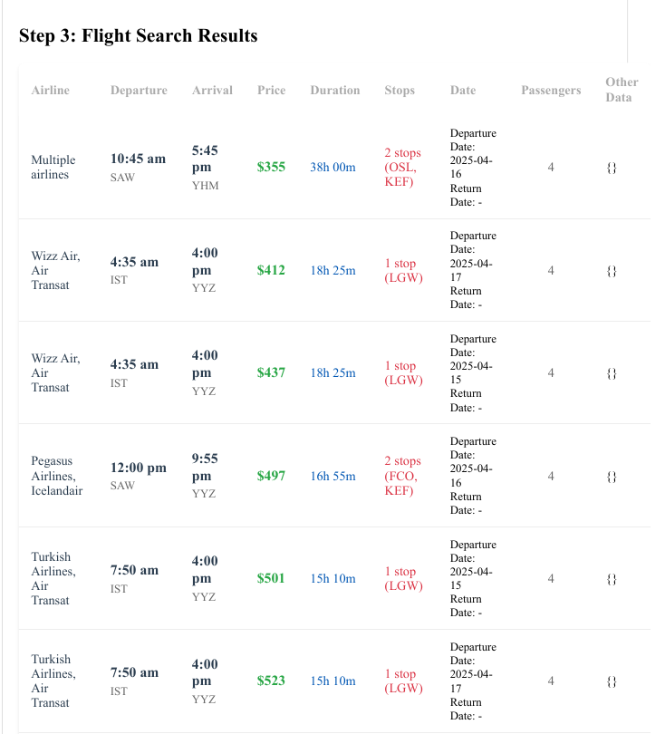
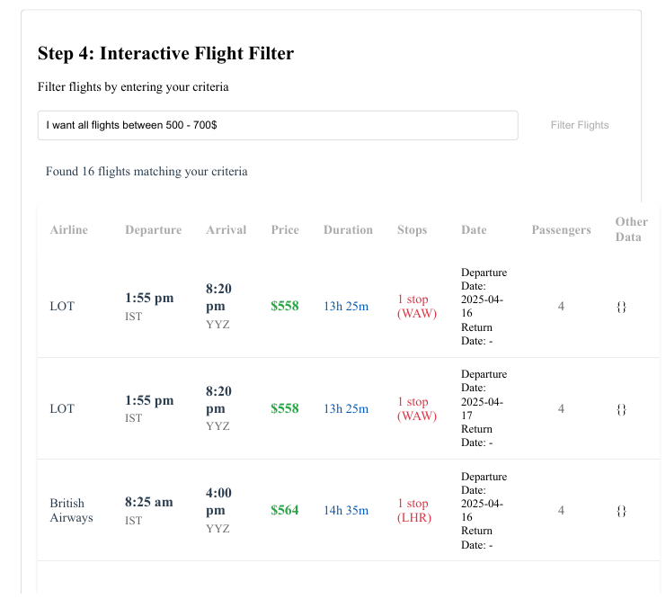

## Autonomous Vision-Powered Travel Agent

Build and run an autonomous agent that plans travel from natural language. It opens real booking sites, visually understands pages via screenshots, and mimics human behavior to extract, filter, and present flight options. The system combines Computer Vision with an LLM to work across sites without brittle HTML selectors and ships with an interactive web UI for refining results.

### What makes it different
- **NLP to intent**: Parse free-form queries into structured flight parameters.
- **Search augmentation**: Generate alternative searches (dates, nearby airports, passenger mixes) to widen coverage.
- **Vision-first crawling**: Drive a real browser and capture screenshots using computer vision techniques rather than depending on site-specific HTML.
- **LLM-based visual extraction**: Read flight cards from images to robustly extract prices, times, airlines, stops, and layovers.
- **Interactive filtering UI**: Refine results live using natural language (e.g., “only nonstop under $500, depart after 10am”).
- **Cache + reproducibility**: Persist intermediate artifacts for debugging and reuse.

## Architecture
1. **Extract**: `modules/flight_extractor.py` interprets the user query into `source_airport`, `destination_airport`, `start_date`, `return_date`, `number_of_passengers` using OpenAI via `modules/utils.py`.
2. **Augment**: `modules/flight_augmentor.py` proposes variant searches (flex dates/nearby) and writes `output/step2_augmented_searches.json`.
3. **Crawl (vision)**: `modules/flight_crawler.py` automates a Chromium browser (Selenium), visits providers (e.g., Kayak), scrolls, and saves screenshots to `static/results/` or `output/step3_images/`.
4. **Analyze (VLM)**: `modules/flight_analyzer.py` parses screenshots with a VLM to structured JSON; exports a markdown/HTML table and `output/step3_all_crawledflights.json` and `.xlsx`.
5. **Filter**: `modules/flight_filter.py` powers live filtering via `/filter` and renders HTML tables.
6. **Web**: `main.py` serves pages (`templates/index.html`, `templates/results.html`) and streams progress with Socket.IO events.

## Requirements
- Python 3.10+
- Google Chrome/Chromium installed
- Matching ChromeDriver available on `PATH` (or configure your path in the crawler)
- An OpenAI API key

Python packages are pinned in `requirements.txt`.

## Setup
1. **Clone and create a virtual env**
```bash
python -m venv .venv
. .venv/Scripts/activate  # Windows PowerShell: .venv\Scripts\Activate.ps1
pip install -r requirements.txt
```

2. **Configure environment**
Create a `.env` file in the project root:
```bash
OPENAI_API_KEY=sk-...your-key...
```

3. **Install Chrome + ChromeDriver**
- Install Chrome (or Chromium).
- Install the matching ChromeDriver and ensure it’s on `PATH`.
- If your Chrome/driver live in custom locations, update the crawler configuration in `modules/flight_crawler.py` accordingly.

## Run
```bash
python main.py
```
Open `http://localhost:5000` and enter a natural language query, for example:
```text
Find me 2 round-trip tickets from SFO to JFK leaving Nov 12 and returning Nov 17, earliest departure after 9am, prefer nonstop, budget $500 per person.
```

### Live workflow
- The UI streams steps: extraction → augmentation → crawling → analysis.
- Results render as an HTML table; use the filter box to refine (e.g., "nonstop under 6h").

### Visual walkthrough (Steps 1–4)
1. **Step 1 – Extract intent from natural language**

   

2. **Step 2 – Augment searches (flex dates/nearby airports)**

   

3. **Step 3 – Vision crawling on provider site(s)**

   

4. **Step 4 – Analyze + interactive filtering UI**

   

## Key endpoints
- `GET /` UI home
- `GET|POST /search` render the results page scaffold
- `Socket event start_search` kicks off the end-to-end pipeline
- `POST /filter` body `{ "query": "nonstop under $500" }` → filtered HTML table
- `POST /clear-cache` deletes `output/` to force a fresh run

## Outputs
- `output/step1_flight_info.json` extracted parameters
- `output/step2_augmented_searches.json` candidate searches
- `static/results/*.png` or `output/step3_images/*.png` page screenshots
- `output/step3_all_crawledflights.json` consolidated results
- `output/step3_all_crawledflights.md` and HTML table (rendered in UI)
- `output/step3_all_crawledflights.xlsx` spreadsheet export

## Sample data gathered from the web for a user query

| airline | departure_time | arrival_time | price | stops | duration | departure_airport | arrival_airport | start_date | return_date | number_of_passengers | other_data |
|-------------|-------------|-------------|-------------|-------------|-------------|-------------|-------------|-------------|-------------|-------------|-------------|
| British Airways | 8:15 am | 4:00 pm | $830 | 1 stop (LHR) | 14h 45m | IST | YYZ | 2025-04-20 | - | 6 | {} |
| Turkish Airlines | 3:30 pm | 7:10 pm | $836 | nonstop | 10h 40m | IST | YYZ | 2025-04-20 | - | 6 | {} |
| Multiple airlines | 4:30 pm | 2:15 pm | $364 | 2 stops (OTP, DUB) | 28h 45m | SAW | YYZ | 2025-04-20 | - | 6 | {} |
| LOT | 1:55 pm | 8:20 pm | $727 | 1 stop (WAW) | 13h 25m | IST | YYZ | 2025-04-20 | - | 6 | {} |
| Wizz Air, Air Transat | 4:35 am | 4:00 pm | $691 | 1 stop (LGW) | 18h 25m | IST | YYZ | 2025-04-20 | - | 6 | {} |
| Pegasus Airlines, Condor | 11:25 am | 5:55 pm | $823 | 1 stop (FRA) | 13h 30m | SAW | YYZ | 2025-04-20 | - | 6 | {} |
| Lufthansa | 6:10 am | 4:20 pm | $777 | 1 stop (FRA) | 17h 10m | IST | YYZ | 2025-04-20 | - | 6 | {} |
| Turkish Airlines, Air Canada | 7:10 am | 2:40 pm | $880 | 1 stop (MUC) | 14h 30m | IST | YYZ | 2025-04-20 | - | 6 | {} |
| Air Canada | 6:10 am | 4:20 pm | $812 | 1 stop (FRA) | 17h 10m | IST | YYZ | 2025-04-20 | - | 6 | {} |
| Lufthansa, Air Canada | 6:10 am | 4:20 pm | $812 | 1 stop (FRA) | 17h 10m | IST | YYZ | 2025-04-20 | - | 6 | {} |
| Turkish Airlines, Condor | 11:30 am | 5:55 pm | $892 | 1 stop (FRA) | 13h 25m | IST | YYZ | 2025-04-20 | - | 6 | {} |
| LOT | 11:25 am | 8:20 pm | $736 | 2 stops (KRK, WAW) | 15h 55m | IST | YYZ | 2025-04-20 | - | 6 | {} |
| Ajet, Icelandair | 10:00 am | 7:10 pm | $713 | 2 stops (MUC, KEF) | 16h 10m | SAW | YYZ | 2025-04-20 | - | 6 | {} |
| Pegasus Airlines, Icelandair | 9:45 am | 7:10 pm | $718 | 2 stops (MUC, KEF) | 16h 25m | SAW | YYZ | 2025-04-20 | - | 6 | {} |

## Troubleshooting
- **ChromeDriver mismatch**: Ensure Chrome and ChromeDriver versions match; verify with `chromedriver --version` and your Chrome About page.
- **Custom Chrome paths**: If Chrome/driver aren’t on `PATH`, set explicit paths in `modules/flight_crawler.py`.
- **Website defenses**: Some sites rate-limit or challenge automation. Re-run, slow down crawl, or vary user-agent if needed.
- **OPENAI_API_KEY missing**: Add it to `.env` or your shell environment.

## Extending
- Add new sites by creating a provider-specific crawler that saves screenshots consistently.
- Adjust the VLM prompts in `modules/flight_analyzer.py` to extract provider-specific fields.
- Expand filter intents in `modules/flight_filter.py`.
